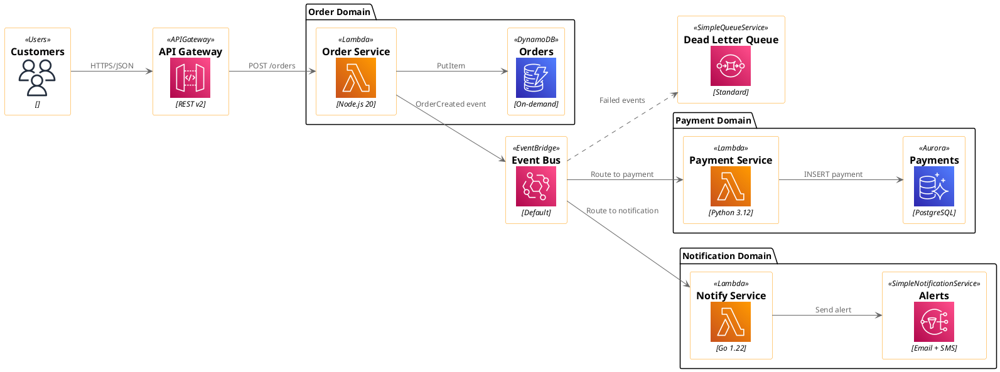
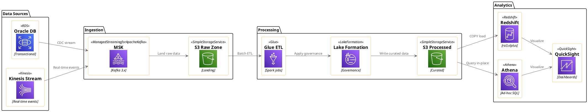
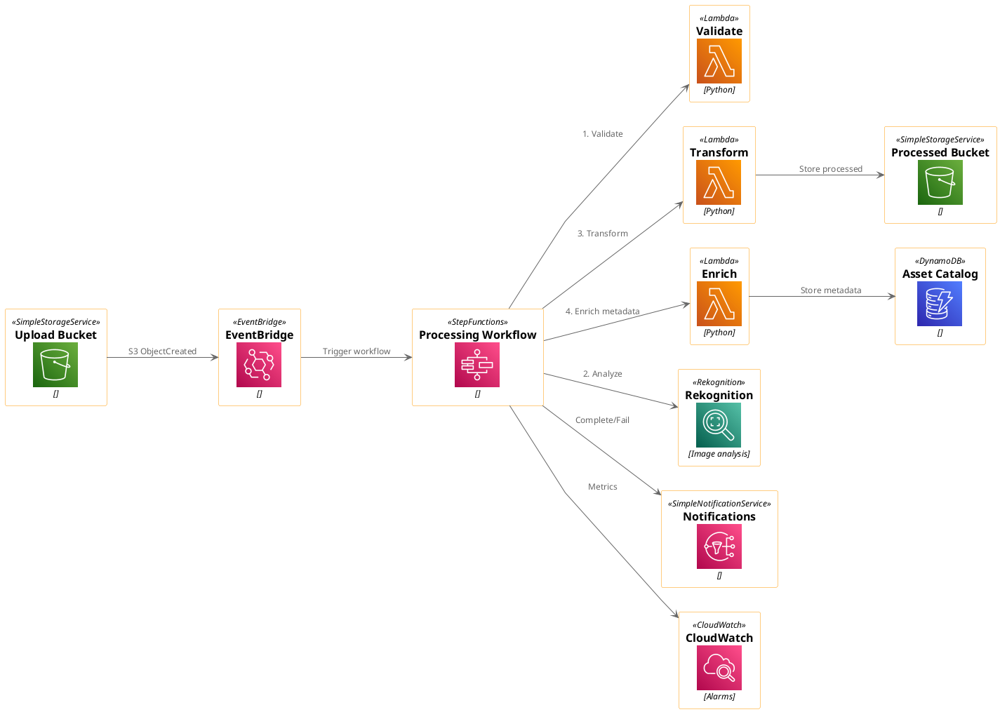
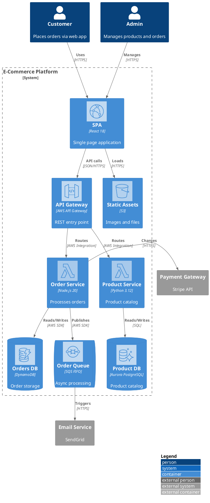
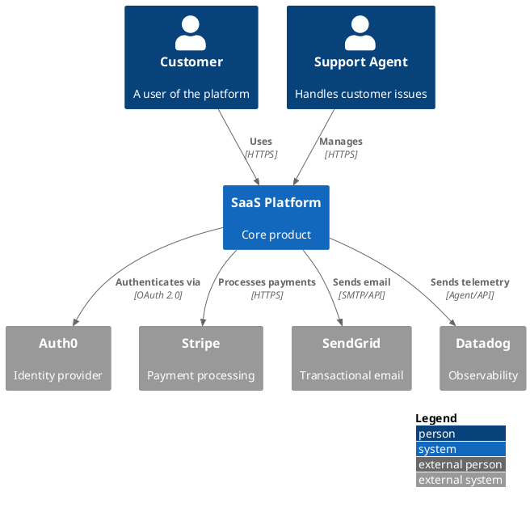
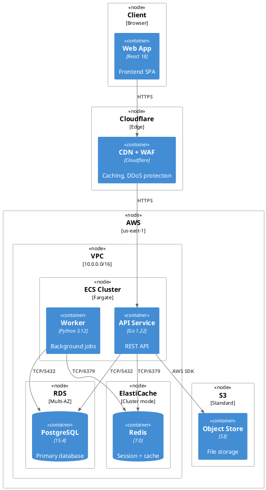

# PlantUML Diagram Examples (via Kroki)

Real-world architecture diagram examples using PlantUML with cloud icons, rendered via Kroki.io.

**Render any example:** `curl -X POST https://kroki.io/plantuml/svg -H "Content-Type: text/plain" -d '<diagram code>'`

---

## Example 1: AWS Three-Tier Web Application

```plantuml
@startuml
!include <awslib/AWSCommon>
!include <awslib/AWSSimplified.puml>
!include <awslib/Compute/EC2>
!include <awslib/Compute/Lambda>
!include <awslib/Database/Aurora>
!include <awslib/Database/ElastiCache>
!include <awslib/NetworkingContentDelivery/CloudFront>
!include <awslib/NetworkingContentDelivery/ElasticLoadBalancing>
!include <awslib/Storage/SimpleStorageService>
!include <awslib/General/Users>
!include <awslib/GroupIcons/all>

left to right direction
skinparam linetype polyline

Users(users, "Web Users", "")

AWSCloudGroup(cloud, "AWS Cloud") {
  CloudFront(cdn, "CloudFront CDN", "")
  SimpleStorageService(s3, "Static Assets", "")

  VPCGroup(vpc, "Production VPC") {
    PublicSubnetGroup(pub, "Public Subnet") {
      ElasticLoadBalancing(alb, "ALB", "")
    }
    PrivateSubnetGroup(priv, "Private Subnet") {
      EC2(web1, "Web Server 1", "t3.medium")
      EC2(web2, "Web Server 2", "t3.medium")
      ElastiCache(cache, "Redis Cache", "r6g.large")
    }
    PrivateSubnetGroup(data, "Data Subnet") {
      Aurora(primary, "Aurora Primary", "PostgreSQL 15")
      Aurora(replica, "Aurora Replica", "Read-only")
    }
  }
}

users --> cdn : HTTPS
cdn --> s3 : Static files
cdn --> alb : API requests
alb --> web1 : Distribute load
alb --> web2 : Distribute load
web1 --> cache : Cache lookup
web2 --> cache : Cache lookup
web1 --> primary : Read/Write
web2 --> primary : Read/Write
primary --> replica : Replication
@enduml
```

**Use case:** Standard web app with load balancing, caching, and database replication.

---

## Example 2: Microservices with Event-Driven Architecture



**Use case:** Event-driven microservices with EventBridge, database-per-service, and dead letter queue.

---

## Example 3: Data ETL Pipeline



**Use case:** Modern data platform with streaming ingestion, batch ETL, and analytics.

---

## Example 4: Serverless Event-Driven Architecture



**Use case:** Serverless media processing pipeline with Step Functions orchestration.

---

## Example 5: C4 Container Diagram with AWS Icons

**Render with:** `POST https://kroki.io/c4plantuml/svg`



**Use case:** C4 container diagram showing e-commerce platform with AWS infrastructure icons.

---

## Example 6: C4 System Context Diagram

**Render with:** `POST https://kroki.io/c4plantuml/svg`



**Use case:** High-level system context showing external integrations.

---

## Example 7: Multi-Region High Availability

```plantuml
@startuml
!include <awslib/AWSCommon>
!include <awslib/Compute/EC2>
!include <awslib/Database/Aurora>
!include <awslib/NetworkingContentDelivery/CloudFront>
!include <awslib/NetworkingContentDelivery/ElasticLoadBalancing>
!include <awslib/NetworkingContentDelivery/Route53>
!include <awslib/Storage/SimpleStorageService>
!include <awslib/General/Users>
!include <awslib/GroupIcons/all>

top to bottom direction
skinparam linetype polyline

Users(users, "End Users", "")
Route53(dns, "Route 53", "GeoDNS")

AWSCloudGroup(cloud, "AWS") {
  RegionGroup(east, "us-east-1 (Primary)") {
    VPCGroup(vpcE, "VPC") {
      ElasticLoadBalancing(albE, "ALB", "")
      EC2(webE, "Web Servers", "Auto Scaling")
      Aurora(dbE, "Aurora Primary", "Writer")
    }
    SimpleStorageService(s3E, "S3 Bucket", "")
  }

  RegionGroup(west, "us-west-2 (DR)") {
    VPCGroup(vpcW, "VPC") {
      ElasticLoadBalancing(albW, "ALB", "")
      EC2(webW, "Web Servers", "Auto Scaling")
      Aurora(dbW, "Aurora Replica", "Reader")
    }
    SimpleStorageService(s3W, "S3 Replica", "")
  }
}

users --> dns
dns --> albE : Primary traffic
dns --> albW : Failover traffic
albE --> webE
albW --> webW
webE --> dbE
webW --> dbW
dbE --> dbW : Cross-region replication
s3E --> s3W : Cross-region replication
@enduml
```

**Use case:** Active-passive multi-region with Aurora cross-region replication.

---

## Example 8: Azure Microservices

```plantuml
@startuml
!include <azure/AzureCommon>
!include <azure/Compute/AzureFunction>
!include <azure/Compute/AzureKubernetesService>
!include <azure/Databases/AzureCosmosDb>
!include <azure/Databases/AzureCacheForRedis>
!include <azure/Analytics/AzureEventHub>
!include <azure/Integration/AzureServiceBus>
!include <azure/Integration/AzureAPIManagement>
!include <azure/DevOps/AzureApplicationInsights>
!include <azure/Identity/AzureActiveDirectory>
!include <azure/Storage/AzureBlobStorage>

left to right direction

actor "User" as user

AzureActiveDirectory(aad, "Azure AD", "", "Auth")
AzureAPIManagement(apim, "API Management", "", "Gateway")

package "Microservices (AKS)" {
  AzureKubernetesService(aks, "AKS Cluster", "1.28", "")
  AzureFunction(orderFn, "Order Function", "C#", "")
  AzureFunction(notifyFn, "Notify Function", "C#", "")
}

AzureCosmosDb(cosmos, "Cosmos DB", "SQL API", "Multi-region")
AzureCacheForRedis(redis, "Redis", "Premium", "Session cache")
AzureServiceBus(bus, "Service Bus", "Premium", "Messaging")
AzureEventHub(hub, "Event Hub", "Standard", "Telemetry")
AzureBlobStorage(blob, "Blob Storage", "Hot", "Documents")
AzureApplicationInsights(ai, "App Insights", "", "APM")

user --> aad : Authenticate
aad --> apim
apim --> aks : Route requests
aks --> cosmos : CRUD operations
aks --> redis : Cache lookups
aks --> bus : Publish events
bus --> orderFn : Process orders
bus --> notifyFn : Send notifications
aks --> hub : Emit telemetry
hub --> ai : Analyze
aks --> blob : Store documents
@enduml
```

**Use case:** Azure microservices with AKS, managed services, and event-driven processing.

---

## Example 9: CI/CD Pipeline

```plantuml
@startuml
!include <awslib/AWSCommon>
!include <awslib/DeveloperTools/CodeBuild>
!include <awslib/DeveloperTools/CodePipeline>
!include <awslib/Containers/ECR>
!include <awslib/Containers/EKS>
!include <awslib/ManagementGovernance/CloudWatch>
!include <awslib/SecurityIdentityCompliance/Inspector>

left to right direction
skinparam linetype polyline

rectangle "GitHub" as gh #333333

package "CI/CD Pipeline" {
  CodePipeline(pipeline, "CodePipeline", "")
  CodeBuild(build, "Build & Test", "")
  Inspector(scan, "Security Scan", "")
  CodeBuild(package, "Docker Build", "")
  ECR(registry, "Container Registry", "")
}

package "Deployment" {
  EKS(dev, "Dev Cluster", "")
  EKS(staging, "Staging", "")
  EKS(prod, "Production", "")
}

CloudWatch(monitor, "CloudWatch", "Alerts")

gh --> pipeline : Webhook
pipeline --> build : Compile + test
build --> scan : Pass
scan --> package : Pass
package --> registry : Push image
registry --> dev : Auto deploy
dev --> staging : Manual approve
staging --> prod : Manual approve
dev --> monitor : Send metrics
staging --> monitor : Send metrics
prod --> monitor : Send metrics
@enduml
```

**Use case:** AWS CI/CD pipeline with progressive deployment and security scanning.

---

## Example 10: C4 Deployment Diagram

**Render with:** `POST https://kroki.io/c4plantuml/svg`



**Use case:** Deployment diagram showing infrastructure topology with protocols and ports.

---

## Tips for Creating Effective Diagrams

### 1. Start Simple, Then Expand

```plantuml
' Start with this
Frontend --> Backend --> Database

' Then add icons and details
!include <awslib/AWSCommon>
!include <awslib/Compute/Lambda>
!include <awslib/Database/Aurora>
Lambda(backend, "API", "Node.js 20")
Aurora(db, "Users DB", "PostgreSQL 15")
```

### 2. Use Consistent Color Themes

Let the cloud icon libraries handle coloring — AWS categories already have distinct colors. Avoid overriding with custom colors unless distinguishing environments.

### 3. Label Connections with Protocol + Data

```plantuml
client --> api : "HTTPS/JSON"
api --> db : "SQL over TLS"
api --> queue : "SQS SendMessage (JSON)"
worker --> s3 : "PutObject (multipart)"
```

### 4. Group by Logical Boundaries

```plantuml
AWSCloudGroup(cloud) {
  VPCGroup(vpc, "Production VPC") {
    PrivateSubnetGroup(priv, "Private") {
      ' services here
    }
  }
}
```

### 5. Use C4 for Formal Architecture Docs

- **Level 1 (Context):** System + external actors — use `c4plantuml` endpoint
- **Level 2 (Container):** Internal containers with tech stack — use `c4plantuml` endpoint
- **Level 3 (Component):** Internal components within a container — use `c4plantuml` endpoint
- **Infrastructure:** Use `plantuml` endpoint with cloud icons directly

## References

- **Kroki API:** https://kroki.io
- **AWS Icons:** https://github.com/awslabs/aws-icons-for-plantuml
- **Azure Icons:** https://github.com/plantuml-stdlib/Azure-PlantUML
- **GCP Icons (stdlib `gcp`):** https://github.com/Crashedmind/PlantUML-icons-GCP
- **C4-PlantUML:** https://github.com/plantuml-stdlib/C4-PlantUML
- **PlantUML Hitchhiker's Guide:** https://crashedmind.github.io/PlantUMLHitchhikersGuide/
