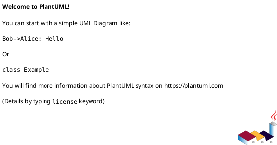
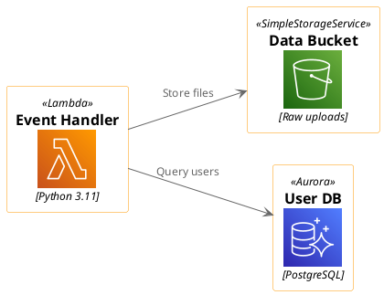

# Kroki + PlantUML Architecture Diagram Syntax Reference

Complete syntax reference for creating cloud architecture diagrams via Kroki.io using PlantUML.

**Kroki API:** https://kroki.io
**PlantUML Docs:** https://plantuml.com
**PlantUML Stdlib:** https://plantuml.com/stdlib

## Kroki API Usage

Kroki wraps 25+ diagram engines behind a single REST API. Free public instance at `https://kroki.io`.

### POST Request (Recommended)

```bash
curl -X POST https://kroki.io/plantuml/svg \
  -H "Content-Type: text/plain" \
  -d '@startuml
Alice -> Bob: Hello
@enduml'
```

**Endpoint pattern:** `POST https://kroki.io/{diagram-type}/{output-format}`

| Diagram Type | Path | Use Case |
|-------------|------|----------|
| `plantuml` | `/plantuml/svg` | Architecture, sequence, component diagrams |
| `c4plantuml` | `/c4plantuml/svg` | C4 model diagrams (context, container, component) |
| `mermaid` | `/mermaid/svg` | Flowcharts, sequence diagrams |
| `d2` | `/d2/svg` | General architecture diagrams |
| `graphviz` | `/graphviz/svg` | Graph/network diagrams |

**Output formats:** `svg`, `png`, `jpeg`, `pdf`

### JSON POST

```bash
curl -X POST https://kroki.io/ \
  -H "Content-Type: application/json" \
  -d '{
    "diagram_source": "@startuml\nAlice -> Bob\n@enduml",
    "diagram_type": "plantuml",
    "output_format": "svg"
  }'
```

### GET Request (Encoded)

Encode with deflate + base64 for URL embedding:

```
GET https://kroki.io/plantuml/svg/{encoded-diagram}
```

### Diagram Options

Pass via JSON body, headers, or query params (in that precedence order):

```json
{ "diagram_source": "...", "diagram_options": { "theme": "cerulean" } }
```

Or: `GET /plantuml/svg/{encoded}?theme=cerulean`

### Rate Limits & Self-Hosting

- **Public instance:** ~100 requests/minute (no auth required)
- **Self-hosted:** Unlimited

```bash
# Quick start
docker run -p8000:8000 yuzutech/kroki

# Full stack (docker-compose.yml):
services:
  kroki:
    image: yuzutech/kroki
    depends_on: [mermaid, bpmn, excalidraw]
    environment:
      - KROKI_MERMAID_HOST=mermaid
      - KROKI_BPMN_HOST=bpmn
      - KROKI_EXCALIDRAW_HOST=excalidraw
    ports: ["8000:8000"]
    tmpfs: ["/tmp:exec"]
  mermaid:
    image: yuzutech/kroki-mermaid
    expose: ["8002"]
  bpmn:
    image: yuzutech/kroki-bpmn
    expose: ["8003"]
  excalidraw:
    image: yuzutech/kroki-excalidraw
    expose: ["8004"]
```

---

## PlantUML Diagram Structure



**Comments:** `' single line` or `/' multi-line '/`

---

## Cloud Architecture Diagrams with AWS/Azure/GCP Icons

### Basic Structure with Cloud Icons



### Include Syntax

**AWS (awslib — built into PlantUML stdlib):**
```plantuml
!include <awslib/AWSCommon>
!include <awslib/Compute/Lambda>
!include <awslib/Compute/EC2>
!include <awslib/Compute/all>          ' Load entire category
```

**Azure (built into PlantUML stdlib):**
```plantuml
!include <azure/AzureCommon>
!include <azure/Compute/AzureFunction>
!include <azure/Databases/AzureCosmosDb>
```

**GCP (gcp — built into PlantUML stdlib):**
```plantuml
!include <gcp/GCPCommon>
!include <gcp/Compute/Cloud_Functions>
!include <gcp/Storage/Cloud_Storage>
!include <gcp/Compute/all>              ' Load entire category
```

**Kubernetes (k8s — built into PlantUML stdlib):**
```plantuml
!include <k8s/Common>
!include <k8s/OSS/KubernetesPod>
!include <k8s/OSS/KubernetesSvc>
!include <k8s/OSS/KubernetesIng>
!include <k8s/OSS/KubernetesDeploy>
!include <k8s/OSS/all>                  ' Load all K8s resources
```

**C4 Model (built into PlantUML stdlib):**
```plantuml
!include <C4/C4_Context>
!include <C4/C4_Container>
!include <C4/C4_Component>
!include <C4/C4_Deployment>
```

### Service Macro Syntax

All cloud icon macros follow the same pattern:

```
ServiceName(alias, "Label", "Technology/Description")
```

**AWS examples:**
```plantuml
Lambda(myFunc, "Order Processor", "Node.js 20")
EC2(server, "Web Server", "t3.large")
SimpleStorageService(s3, "Assets", "Static files")
Aurora(db, "Main DB", "PostgreSQL 15")
ElastiCache(cache, "Session Cache", "Redis 7")
APIGateway(api, "REST API", "v2 HTTP")
SimpleQueueService(queue, "Task Queue", "FIFO")
SimpleNotificationService(sns, "Alerts", "Email + SMS")
DynamoDB(dynamo, "Sessions", "On-demand")
CloudFront(cdn, "CDN", "Global edge")
```

**Azure examples:**
```plantuml
AzureFunction(func, "Processor", "C# .NET 8")
AzureCosmosDb(cosmos, "Documents", "SQL API")
AzureKubernetesService(aks, "K8s Cluster", "1.28")
AzureSqlDatabase(sql, "Users DB", "S3 tier")
AzureBlobStorage(blob, "Files", "Hot tier")
AzureEventHub(hub, "Events", "Standard")
```

**GCP examples:**
```plantuml
Cloud_Functions(cf, "Handler", "Python 3.11")
Cloud_Storage(gcs, "Bucket", "Multi-region")
Compute_Engine(gce, "VM", "e2-standard-4")
CloudRun(service, "API", "Go")
CloudSQL(db, "Users DB", "PostgreSQL 15")
BigQuery(bq, "Analytics", "Standard")
CloudPubSub(topic, "Events", "Standard")
```

**Kubernetes examples:**
```plantuml
KubernetesPod(pod, "app-pod", "")
KubernetesSvc(svc, "app-service", "")
KubernetesIng(ing, "ingress", "")
KubernetesDeploy(deploy, "app-deploy", "")
KubernetesHpa(hpa, "autoscaler", "")
KubernetesCm(cm, "app-config", "")
KubernetesSecret(secret, "app-secrets", "")
```

---

## Layout & Direction

```plantuml
left to right direction     ' Horizontal flow (best for architecture)
top to bottom direction     ' Vertical flow (default)
```

### Controlling Connection Direction

```plantuml
A -down-> B : flows down
A -right-> B : flows right
A -left-> B : flows left
A -up-> B : flows up

' Short form
A -d-> B
A -r-> B
A -l-> B
A -u-> B
```

---

## Grouping & Boundaries

### Package (Generic Group)

```plantuml
package "AWS Cloud" {
  package "VPC" {
    Lambda(func, "Handler", "")
    Aurora(db, "Database", "")
  }
}
```

### Rectangle (Styled Group)

```plantuml
rectangle "Production" #LightBlue {
  Lambda(func, "Handler", "")
}
```

### Cloud Shape

```plantuml
cloud "AWS" {
  Lambda(func, "Handler", "")
}
```

### AWS-Specific Group Macros

```plantuml
!include <awslib/GroupIcons/all>

AWSCloudGroup(cloud, "AWS Cloud") {
  VPCGroup(vpc, "Production VPC") {
    AvailabilityZoneGroup(az1, "us-east-1a") {
      PublicSubnetGroup(pub1, "Public") {
        EC2(web, "Web Server", "")
      }
      PrivateSubnetGroup(priv1, "Private") {
        Aurora(db, "Database", "")
      }
    }
  }
}
```

### Kubernetes Boundaries

```plantuml
Cluster_Boundary(cluster, "Kubernetes Cluster") {
  Namespace_Boundary(ns, "production") {
    KubernetesPod(pod, "app", "")
  }
}
```

### Together Block (Layout Hint)

Groups elements visually without creating a boundary:

```plantuml
together {
  Lambda(func1, "Function 1", "")
  Lambda(func2, "Function 2", "")
}
```

---

## Connection Types

| Syntax | Appearance | Use Case |
|--------|------------|----------|
| `-->` | Solid arrow | Primary data flow |
| `..>` | Dotted arrow | Async/optional flow |
| `--` | Solid line | Association (no direction) |
| `..` | Dotted line | Weak dependency |
| `->` | Short solid arrow | Tight coupling |

### Connection Labels

```plantuml
A --> B : HTTPS/JSON
A ..> B : Async events
A --> B : "1. Authenticate"
```

### Connection Styling

```plantuml
A -[#red]-> B : Error path
A -[#green,dashed]-> B : Success path
A -[thickness=3]-> B : High-throughput
```

### Hidden Connections (Layout Control)

```plantuml
A -[hidden]-> B    ' Forces positioning without visible arrow
```

---

## Styling (skinparam)

### Common Settings for Architecture Diagrams

```plantuml
skinparam linetype ortho          ' Right-angle connections
skinparam linetype polyline       ' Smooth connections
skinparam nodesep 60              ' Horizontal spacing
skinparam ranksep 80              ' Vertical spacing
skinparam padding 8
skinparam defaultFontName "Segoe UI"
skinparam defaultFontSize 12
skinparam shadowing false
skinparam backgroundColor white
```

### Element-Specific Styling

```plantuml
skinparam rectangle {
  BackgroundColor #f0f0f0
  BorderColor #333333
}
skinparam database {
  BackgroundColor #E8F5E9
  BorderColor #2E7D32
}
skinparam arrow {
  Color #666666
  FontSize 10
}
```

### Inline Element Styling

```plantuml
node mynode #aliceblue;line:blue;line.dotted;text:blue
database db #E8F5E9;line:green;line.bold
```

### Simplified View (Hide Descriptions)

```plantuml
!include <awslib/AWSCommon>
!include <awslib/AWSSimplified>    ' Hides description text in icons
```

---

## C4 Model Diagrams

C4-PlantUML provides structured architecture modeling (Context → Container → Component → Code).

**IMPORTANT:** Use endpoint `/c4plantuml/svg` (not `/plantuml/svg`) when rendering C4 diagrams via Kroki.

### Quick Reference

```plantuml
@startuml
!include <C4/C4_Container>

Person(user, "User", "End user of the system")
System_Boundary(sys, "My System") {
  Container(app, "Web App", "React", "Frontend SPA")
  ContainerDb(db, "Database", "PostgreSQL", "Stores user data")
}
System_Ext(email, "Email Service", "Sends notifications")

Rel(user, app, "Uses", "HTTPS")
Rel(app, db, "Reads/Writes", "SQL")
Rel(app, email, "Sends emails", "SMTP")

LAYOUT_WITH_LEGEND()
@enduml
```

### C4 Macros Summary

| Macro | Use |
|-------|-----|
| `Person(alias, "Label", "Desc")` | Human actor |
| `Person_Ext(alias, "Label", "Desc")` | External actor |
| `System(alias, "Label", "Desc")` | Internal system |
| `System_Ext(alias, "Label", "Desc")` | External system |
| `SystemDb(alias, "Label", "Desc")` | Database system |
| `SystemQueue(alias, "Label", "Desc")` | Queue system |
| `Container(alias, "Label", "Tech", "Desc")` | Container/service |
| `ContainerDb(alias, "Label", "Tech", "Desc")` | Database container |
| `ContainerQueue(alias, "Label", "Tech", "Desc")` | Queue container |
| `Component(alias, "Label", "Tech", "Desc")` | Component |
| `ComponentDb(alias, "Label", "Tech", "Desc")` | Database component |
| `System_Boundary(alias, "Label")` | System boundary |
| `Container_Boundary(alias, "Label")` | Container boundary |
| `Deployment_Node(alias, "Label", "Type", "Desc")` | Deployment node |
| `Rel(from, to, "Label", "Tech")` | Relationship |
| `Rel_D(from, to, "Label", "Tech")` | Downward relationship |
| `Rel_R(from, to, "Label", "Tech")` | Rightward relationship |
| `Rel_L(from, to, "Label", "Tech")` | Leftward relationship |
| `Rel_U(from, to, "Label", "Tech")` | Upward relationship |
| `Rel_Back(from, to, "Label", "Tech")` | Reverse relationship |
| `BiRel(from, to, "Label", "Tech")` | Bidirectional relationship |

### C4 Layout Options

```plantuml
LAYOUT_TOP_DOWN()           ' Default vertical
LAYOUT_LEFT_RIGHT()         ' Horizontal
LAYOUT_LANDSCAPE()          ' Wide landscape
LAYOUT_WITH_LEGEND()        ' Add legend
SHOW_LEGEND()               ' Show legend separately
HIDE_STEREOTYPE()           ' Remove stereotype labels
```

### C4 Tags and Custom Styling

```plantuml
AddElementTag("critical", $bgColor="#FF0000", $fontColor="white")
AddRelTag("async", $lineColor="#FF6600", $lineStyle=DashedLine())

Container(api, "API", "Java", "REST API", $tags="critical")
Rel(api, db, "Reads", "JDBC", $tags="async")
```

### Using Cloud Icons with C4

```plantuml
@startuml
!include <C4/C4_Container>
!include <awslib/AWSCommon>
!include <awslib/Compute/Lambda>
!include <awslib/Database/DynamoDB>

Person(user, "Customer", "Uses the web app")
System_Boundary(aws, "AWS Cloud") {
  Container(func, "Order Service", "Node.js", "Business logic", $sprite="Lambda")
  ContainerDb(db, "Orders", "DynamoDB", "Order storage", $sprite="DynamoDB")
}

Rel(user, func, "Makes API calls", "HTTPS")
Rel(func, db, "Reads/Writes", "AWS SDK")
LAYOUT_WITH_LEGEND()
@enduml
```

---

## Notes & Annotations

```plantuml
note right of component : "This handles auth"
note left of component
  Multi-line
  note text
end note
note "Floating note" as N1
```

---

## Tips & Best Practices

1. **Use `left to right direction`** for wide architecture diagrams
2. **Include only what you need** — avoid `all.puml` for large categories (slows rendering)
3. **Use AWS group macros** (`AWSCloudGroup`, `VPCGroup`) for proper cloud boundaries
4. **Label every connection** with protocol/data format (e.g., "HTTPS/JSON", "gRPC/Protobuf")
5. **Use `skinparam linetype ortho`** for clean right-angle connections
6. **Direction hints** (`-down->`, `-right->`) help control layout when auto-layout fails
7. **`together` blocks** group related elements without enclosing boundaries
8. **Hidden connections** (`--[hidden]>`) position elements without visible arrows
9. **Build incrementally** — start with basic structure, then add styling and details
10. **Use C4 model** for formal architecture documentation (Context → Container → Component)

## Kroki-Specific Gotchas

### stdlib Includes Work on Kroki
PlantUML's bundled stdlib (`!include <awslib/...>`, `<azure/...>`, `<gcp/...>`, `<k8s/...>`, `<C4/...>`) works on the public Kroki instance. All major cloud icon libraries are in the stdlib — no external URLs needed. URL-based includes (`!include https://...`) may not work due to security restrictions. **Always prefer stdlib includes.**

### C4 Diagrams Use a Separate Endpoint
Use `/c4plantuml/svg`, not `/plantuml/svg`, for C4 model diagrams.

### Public Instance Limits
100 req/min is fine for CI/CD and developer tools. For batch processing or user-facing apps, self-host with Docker.

### `!includeurl` is Deprecated
Use `!include` for both local paths and URLs.

## Troubleshooting

### Diagram too wide/tall
- Switch `left to right direction` ↔ `top to bottom direction`
- Use direction hints on connections
- Add `together` blocks for related elements

### Icons not rendering
- Verify include path is correct (`<awslib/...>` for stdlib)
- Check service name matches exactly (case-sensitive)
- For GCP: use `<gcp/...>` stdlib prefix; for K8s: use `<k8s/...>` stdlib prefix

### Layout issues
- Add `skinparam nodesep 40` and `skinparam ranksep 60`
- Use `--[hidden]>` connections to force positioning
- Try `skinparam linetype ortho`

### Kroki API errors
- Check diagram syntax is valid PlantUML
- Ensure `@startuml` / `@enduml` wrapper is present
- Verify Content-Type header is `text/plain` for POST requests

## References

- **Kroki API:** https://kroki.io | **Docs:** https://docs.kroki.io
- **AWS Icons:** https://github.com/awslabs/aws-icons-for-plantuml | **Symbols:** AWSSymbols.md
- **Azure Icons:** https://github.com/plantuml-stdlib/Azure-PlantUML | **Symbols:** AzureSymbols.md
- **GCP Icons (stdlib `gcp`):** https://github.com/Crashedmind/PlantUML-icons-GCP
- **C4-PlantUML:** https://github.com/plantuml-stdlib/C4-PlantUML
- **K8s Icons (stdlib `k8s`):** https://github.com/dcasati/kubernetes-PlantUML
- **PlantUML Stdlib:** https://plantuml.com/stdlib