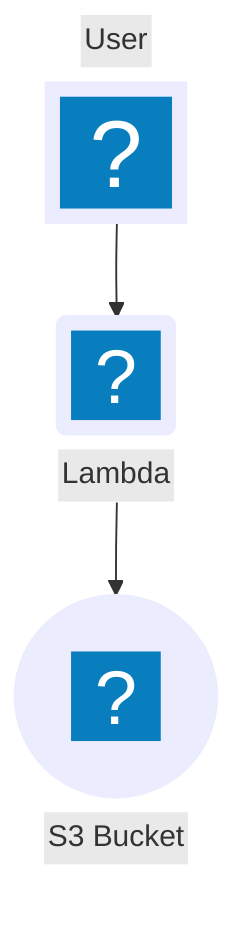
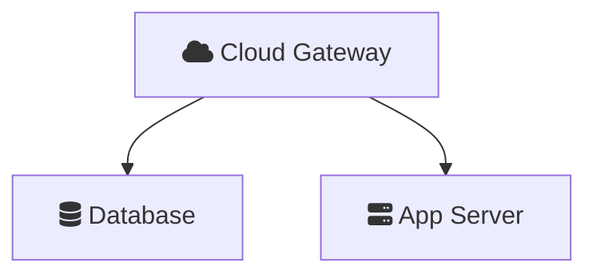

# Mermaid Syntax Reference

Mermaid is a JavaScript-based diagramming tool that renders text definitions into diagrams. As of v11.x it supports a dedicated **architecture diagram** type plus C4 diagrams, flowcharts with icon shapes, and 20+ other diagram types.

## Rendering Options

### Via Kroki (matches existing PlantUML workflow)

```bash
curl -X POST https://kroki.io/mermaid/svg \
  -H "Content-Type: text/plain" \
  -d 'architecture-beta
    group api(cloud)[API]
    service db(database)[Database] in api
    service server(server)[Server] in api
    db:L -- R:server' \
  -o diagram.svg
```

**Caveat:** Kroki's Mermaid renderer only supports the 5 built-in icons (`cloud`, `database`, `disk`, `internet`, `server`). Custom Iconify icon packs require the Mermaid CLI or browser rendering instead.

**Self-hosted Kroki with Mermaid support** requires docker-compose (the single container lacks the Mermaid companion):

```yaml
# docker-compose.yml
services:
  kroki:
    image: yuzutech/kroki
    ports:
      - "8000:8000"
    environment:
      - KROKI_MERMAID_HOST=mermaid
  mermaid:
    image: yuzutech/kroki-mermaid
    expose:
      - "8002"
```

### Via Mermaid CLI (mmdc) — Full icon support

```bash
npm install -g @mermaid-js/mermaid-cli

# Render a .mmd file
mmdc -i diagram.mmd -o diagram.svg

# With custom puppeteer config (for icon packs)
mmdc -i diagram.mmd -o diagram.svg -p puppeteer-config.json
```

### Via Browser/HTML — Full icon support with registerIconPacks()

```html
<script type="module">
  import mermaid from 'https://cdn.jsdelivr.net/npm/mermaid@11/dist/mermaid.esm.min.mjs';

  mermaid.registerIconPacks([
    {
      name: 'logos',
      loader: () =>
        fetch('https://unpkg.com/@iconify-json/logos@1/icons.json')
          .then((res) => res.json()),
    },
  ]);

  mermaid.initialize({ startOnLoad: true });
</script>
```

---

## Architecture Diagrams (`architecture-beta`)

Introduced in v11.1.0. Purpose-built for cloud and infrastructure topology visualization. The `beta` suffix is part of the keyword — the feature is usable but syntax may evolve.

### Building Blocks

| Element   | Purpose                              | Syntax                                            |
|-----------|--------------------------------------|---------------------------------------------------|
| Group     | Container for related services       | `group {id}({icon})[{title}]`                     |
| Service   | Individual node                      | `service {id}({icon})[{title}]`                   |
| Edge      | Connection between services          | `{id}:{side} -- {side}:{id}`                      |
| Junction  | 4-way connection split point         | `junction {id}`                                   |

### Groups

```
group {id}({icon})[{title}]
group {id}({icon})[{title}] in {parent_id}
```

Groups can be nested. The icon and title are both optional:

```
group vpc(cloud)[AWS VPC]
group private_subnet(cloud)[Private Subnet] in vpc
```

### Services

```
service {id}({icon})[{title}]
service {id}({icon})[{title}] in {group_id}
```

A service placed `in` a group renders inside that group's boundary:

```
service db(database)[PostgreSQL] in private_subnet
```

### Edges

Edges connect services via directional ports:

```
{serviceId}:{T|B|L|R} -- {T|B|L|R}:{serviceId}     # undirected
{serviceId}:{T|B|L|R} --> {T|B|L|R}:{serviceId}     # arrow right
{serviceId}:{T|B|L|R} <-- {T|B|L|R}:{serviceId}     # arrow left
```

**Direction indicators:** `T` (top), `B` (bottom), `L` (left), `R` (right)

The side you pick controls layout — connecting `R` to `L` places nodes side by side; `B` to `T` stacks them vertically.

### Group Edges

Route edges at the group boundary level:

```
server{group}:B --> T:subnet{group}
```

### Junctions

Split one connection into multiple paths:

```
junction juncA in vpc
service a(server)[A] in vpc
service b(server)[B] in vpc
service c(server)[C] in vpc

a:R -- L:juncA
juncA:R -- L:b
juncA:B -- T:c
```

### Built-in Icons (No Registration Required)

These work everywhere — Kroki, GitHub, GitLab, any renderer:

| Name       | Visual          |
|------------|-----------------|
| `cloud`    | Cloud shape     |
| `database` | Cylinder        |
| `disk`     | Storage disk    |
| `internet` | Globe           |
| `server`   | Server rack     |

### External Icons (Requires Registration)

When `registerIconPacks()` is available, use `{pack}:{icon}` format:

```
service lambda(logos:aws-lambda)[Lambda Function]
group vpc(logos:aws-vpc)[VPC]
```

See **mermaid-icon-reference.md** for complete icon pack catalog.

---

## C4 Diagrams (Experimental)

Mermaid supports all five C4 model diagram types. Syntax may change in future releases.

### Diagram Types

| Keyword         | Type              |
|-----------------|-------------------|
| `C4Context`     | System Context    |
| `C4Container`   | Container         |
| `C4Component`   | Component         |
| `C4Dynamic`     | Dynamic           |
| `C4Deployment`  | Deployment        |

### People and Systems

```
Person(alias, "Label", "Description")
Person_Ext(alias, "Label", "Description")
System(alias, "Label", "Description")
System_Ext(alias, "Label", "Description")
SystemDb(alias, "Label", "Description")
SystemQueue(alias, "Label", "Description")
```

### Containers and Components

```
Container(alias, "Label", "Technology", "Description")
ContainerDb(alias, "Label", "Technology", "Description")
ContainerQueue(alias, "Label", "Technology", "Description")
Component(alias, "Label", "Technology", "Description")
ComponentDb(alias, "Label", "Technology", "Description")
ComponentQueue(alias, "Label", "Technology", "Description")
```

### Boundaries

```
Boundary(alias, "Label") {
  Container(...)
}
Enterprise_Boundary(alias, "Label") { ... }
System_Boundary(alias, "Label") { ... }
Container_Boundary(alias, "Label") { ... }
```

### Relationships

```
Rel(from, to, "Label")
Rel(from, to, "Label", "Technology")
BiRel(from, to, "Label")
Rel_U(from, to, "Label")    // upward
Rel_D(from, to, "Label")    // downward
Rel_L(from, to, "Label")    // leftward
Rel_R(from, to, "Label")    // rightward
Rel_Back(from, to, "Label")
```

### Deployment-specific

```
Deployment_Node(alias, "Label", "Technology") {
  Container(...)
}
```

### Styling

```
UpdateElementStyle(alias, $fontColor="red", $bgColor="blue", $borderColor="green")
UpdateRelStyle(from, to, $textColor="blue", $offsetX="10", $offsetY="-20")
UpdateLayoutConfig($c4ShapeInRow="3", $c4BoundaryInRow="1")
```

### C4 Limitations in Mermaid

Not supported: sprites, tags, links, legend, `Lay_U/D/L/R`, `AddElementTag()`, `AddRelTag()`.

---

## Flowchart Icon Shapes (v11.3.0+)

Flowcharts support a dedicated `icon` shape via `@{}` syntax. Useful for quick diagrams with branded icons.

### Icon Shape Syntax



### Parameters

| Parameter | Values                               | Default       | Description                      |
|-----------|--------------------------------------|---------------|----------------------------------|
| `icon`    | `"pack:name"`                        | required      | Icon from a registered pack      |
| `form`    | `"square"`, `"circle"`, `"rounded"`  | none          | Background shape                 |
| `label`   | any string                           | none          | Text label                       |
| `pos`     | `"t"` (top), `"b"` (bottom)         | `"b"`         | Label position                   |
| `h`       | number                               | 48            | Icon height (min 48)             |

### Image Shape (Embed Any URL)

```mermaid
flowchart TD
    A@{ img: "https://example.com/logo.png", label: "My Service", w: 60, h: 60, constraint: "off" }
```

### Legacy FontAwesome in Labels

Flowcharts support inline FA icons in bracket labels:



Supported prefixes: `fa:`, `fab:`, `fas:`, `far:`, `fal:`, `fad:`.

### Styling Icon Nodes


---

## All Architecture-Relevant Diagram Types

| Type              | Keyword               | Best for                                      |
|-------------------|-----------------------|-----------------------------------------------|
| Architecture      | `architecture-beta`   | Cloud topology, deployment diagrams            |
| Flowchart         | `flowchart`           | Processes, decision trees, general with icons  |
| C4 Context        | `C4Context`           | High-level system relationships                |
| C4 Container      | `C4Container`         | Application internals                          |
| C4 Component      | `C4Component`         | Component breakdown                            |
| C4 Deployment     | `C4Deployment`        | Infrastructure mapping                         |
| C4 Dynamic        | `C4Dynamic`           | Interaction sequences                          |
| Sequence          | `sequenceDiagram`     | API call flows, service interactions           |
| Class             | `classDiagram`        | Domain models, object models                   |
| State             | `stateDiagram`        | State machines, lifecycle                      |
| ER Diagram        | `erDiagram`           | Data models, schema relationships              |
| Block             | `block-beta`          | General block arrangements                     |

---

## Kroki Endpoint

| Diagram type | Endpoint                         |
|--------------|----------------------------------|
| Mermaid      | `POST https://kroki.io/mermaid/svg` |

The Mermaid text is sent as the POST body with `Content-Type: text/plain`, identical to PlantUML rendering.

---

## Platform Limitations

| Platform                  | Built-in icons | Custom icon packs | C4 diagrams |
|---------------------------|---------------|-------------------|-------------|
| GitHub / GitLab           | Yes           | No                | Yes         |
| Confluence                | Yes           | No                | Yes         |
| Kroki (docker-compose)    | Yes           | No                | Yes         |
| Mermaid CLI (mmdc)        | Yes           | Yes (via config)  | Yes         |
| Browser with JS           | Yes           | Yes               | Yes         |

On platforms where JavaScript is unavailable (GitHub, GitLab), only the 5 built-in icons work. For cloud-branded icons, either render locally and embed images, or use PlantUML/Kroki which has cloud icons in its stdlib.

---

## When to Use Mermaid vs PlantUML vs Eraser

| Factor                    | Mermaid                        | PlantUML/Kroki               | Eraser                         |
|---------------------------|--------------------------------|------------------------------|--------------------------------|
| **GitHub native render**  | Yes (built-in icons only)      | No                           | No                             |
| **Cloud icon breadth**    | Limited (logos pack ~20 AWS)   | Extensive (900+ AWS stdlib)  | Good (700+ AWS, 500+ GCP)     |
| **Rendering cost**        | Free                           | Free                         | API key required               |
| **Architecture diagram**  | Yes (`architecture-beta`)      | Manual with icons            | Yes (native)                   |
| **C4 model**              | Yes (experimental)             | Yes (mature)                 | No                             |
| **Styling**               | CSS classes                    | skinparam                    | watercolor, bold, pastel       |
| **Best for**              | GitHub docs, simple topologies | Full cloud architecture      | Visual presentations           |
