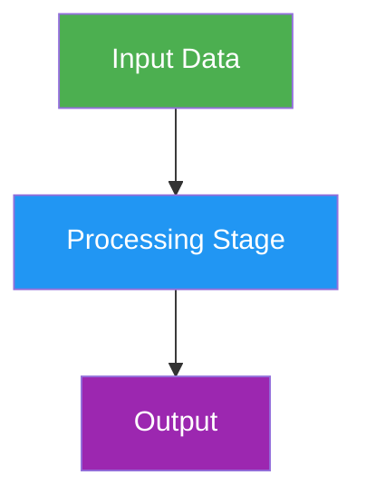
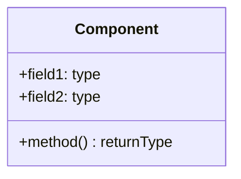
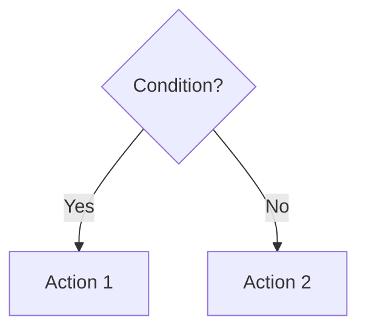

# Technical Debrief Outline

## Overview

This skill generates comprehensive, structured presentation outlines for technical debriefs. It produces documents optimized for presenting complex technical work to mixed audiences (engineers, PMs, executives) with the right level of detail, real examples, and visual diagrams.

## When to Use This Skill

- Preparing debrief meetings for stakeholders
- Creating technical presentation outlines
- Documenting architecture decisions for review
- Presenting POC results and redesign proposals
- Walking through system implementations

## Workflow

### Phase 1: Gather Context

Before creating the outline, gather essential information:

1. **Meeting Details**
   - Audience composition (engineers, PMs, executives)
   - Time constraint (e.g., 30-40 minutes)
   - Presentation format (live demo, slides, document walkthrough)

2. **Content Scope**
   - What systems/features to cover
   - Comparison points (e.g., POC vs. production, v1 vs. v2)
   - Key decisions that need explanation

3. **Reference Materials**
   - Spawn subagents to read large docs (avoid context rot)
   - Identify existing architecture docs, specs, output examples
   - Locate real API responses and data samples

### Phase 2: Create Document Structure

Use this standard structure:

```markdown
## Document References

| Topic | Reference Document | Section |
|-------|-------------------|---------|
| Business Requirements | `docs/REQUIREMENTS.md` | Full document |
| Architecture | `docs/architecture.md` | System Overview |
| Output Examples | `reports/output_20260127/` | All files |
| Implementation | `src/module/` | Lines 100-150 |

---

## Section 1: Business Problem & Goals

> "One-sentence elevator pitch of what we're building and why."

### Key Points

**What we're building:**
- Point 1
- Point 2

**Business Goals:**
- Goal 1
- Goal 2

**Acceptance Criteria:**
- Criterion 1
- Criterion 2

---

## Section 2: Domain Context & Prerequisites

### 2A. [First Concept]
### 2B. [Second Concept]
### 2C. [Third Concept]

---

## Section 3: [Current State / POC] Walkthrough

### 3A. High-Level Architecture
### 3B. Output Example
### 3C. Challenges That Led to [Next Version]

---

## Section 4: [New Design / Solution] Architecture

### 4A. [Stage/Component 1]
### 4B. [Stage/Component 2]
### 4C. [Stage/Component 3]
### 4D. Summary: How [New] Solves [Old] Problems

---

## Section 5: Demo & Q&A

---

## Implementation Status

| Component | Status |
|-----------|--------|
| Feature 1 | **Implemented** |
| Feature 2 | **Planned** |

---

## APPENDIX A: Technical Deep Dive
(Detailed technical content for engineer follow-up)
```

### Phase 3: Apply Writing Guidelines

#### Language Style

- Use simple, direct language
- Write in imperative form for instructions
- Avoid jargon unless explained
- Keep sentences short and scannable

#### Code/JSON Examples

Use inline `//` comments for annotations:

```json
{
  "bill_id": "HR-150",        // Unique identifier for the bill
  "congress": 118,            // Session number (118th = 2023-2025)
  "status": "Introduced",     // Current legislative stage
  "textVersions": {
    "count": 3                // Number of versions for evolution analysis
  }
}
```

#### Callout Quotes

Use blockquotes for key messages the presenter should say:

```markdown
> "NRG's Legal team manually tracks legislative bills across 50 states.
> We're automating this with AI - from discovery to actionable recommendations."
```

#### Comparison Tables

Use tables for comparing concepts, versions, or approaches:

```markdown
| Aspect | POC Approach | Production Approach |
|--------|--------------|---------------------|
| Token Usage | 60K per item | 31K per item (48% reduction) |
| Validation | None | Two-tier with fallback |
| Evidence | Black box | Full audit trail |
```

### Phase 4: Add Visual Diagrams

Include Mermaid diagrams for architecture sections:

#### Flowcharts for Pipelines



#### Class Diagrams for Data Models



#### Decision Flows



**Diagram Guidelines:**
- Remove unnecessary complexity (no cloud infrastructure unless relevant)
- Keep diagram-specific colors consistent throughout document
- Only include diagrams when they add clarity; tables often suffice

### Phase 5: Ensure "Why" Explanations

For every technical decision or feature, answer:

1. **What problem does this solve?**
2. **Why is this approach better than alternatives?**
3. **What questions might the audience ask?**

Example Pattern:

```markdown
#### Problem: Token Cost Explosion

**The Issue:**
- Each version analyzed independently (no memory)
- 5 versions + 4 diffs = 9 separate analyses
- Each analysis ~6,700 tokens → 60,000+ tokens per item

**Why It's a Problem:**
- Cost: $0.10 per run becomes $1+ with many items
- Latency: 9 sequential calls = 45-90 seconds
- No efficiency gain from prior context

**Solution in v2:**
Sequential memory reduces to 31K tokens (48% savings)
```

### Phase 6: Include Real Examples

Never use simplified or fake data. Always:

1. Call actual APIs and store responses
2. Reference real output files with paths
3. Include actual code snippets with line numbers

```markdown
**Real Example from Production:**
> **Reference:** `reports/analysis_20260127/output.json` - Lines 1438-1495

> **Reference:** `src/analysis/scoring.py` lines 246-286 - stability formula
```

### Phase 7: Preempt Audience Questions

For each section, include questions the audience might ask:

```markdown
**Questions We Can Answer:**
- Which facts led to this conclusion?
- What sources support this finding?
- What would falsify this interpretation?
- Which assumptions are critical?
```

## Iteration Guidelines

After initial draft:

1. **User provides feedback** - typically section-by-section
2. **Common refinements:**
   - "Missing real examples" → Fetch actual API data
   - "Missing the WHY" → Add problem-solution framing
   - "Too complex" → Simplify language, remove unnecessary diagrams
   - "Update file references" → Find current paths

3. **Handle outdated references:**
   - Search for new output directories
   - Update line number references
   - Verify file existence before citing

## Output Deliverable

The final document should be:

- A single Markdown file (e.g., `OUTLINE_DEBRIEF.md`)
- Stored in `docs/` directory
- Contains all Mermaid diagrams inline
- References supporting files in `docs/data_examples/` or similar
- Ready for live presentation walkthrough

## Resources

### references/

Store supporting reference files:
- `outline_template.md` - Blank template with section placeholders
- `mermaid_patterns.md` - Common diagram patterns for technical docs

### assets/

Store example data:
- `data_examples/` - Real API responses with inline comments
- `sample_outputs/` - Example analysis outputs to reference
