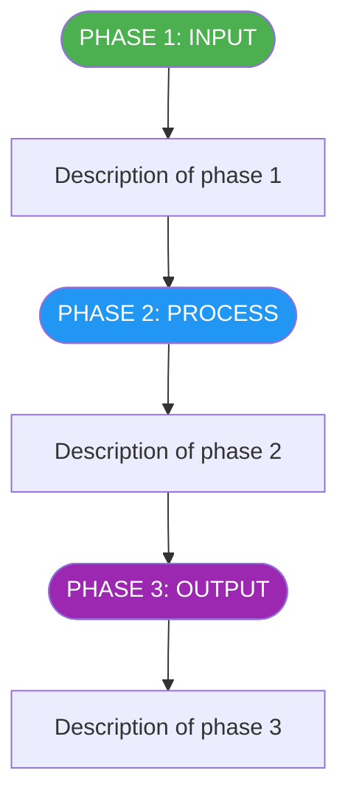
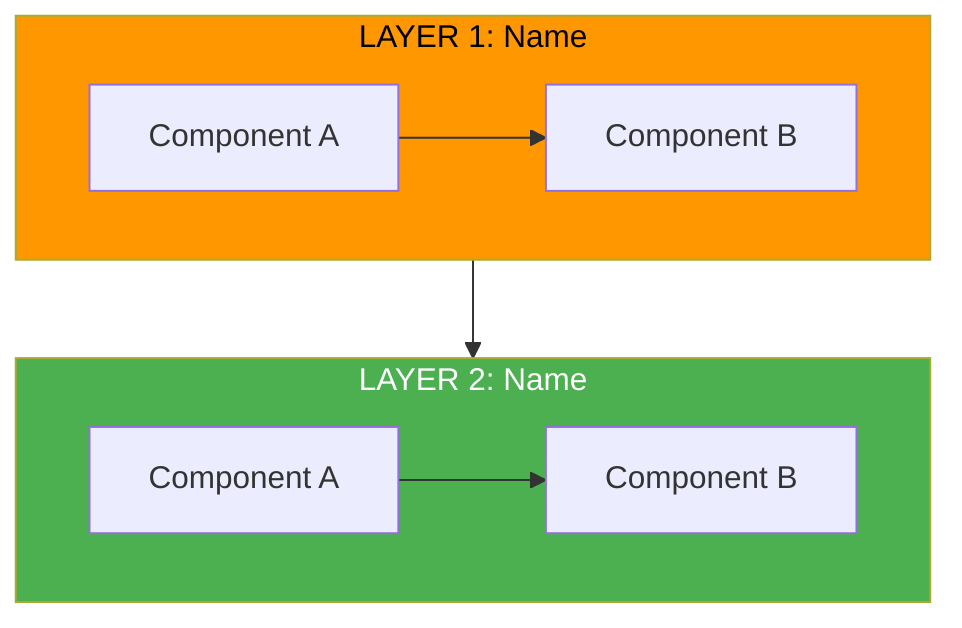
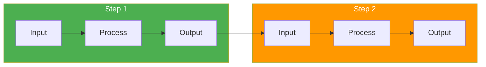
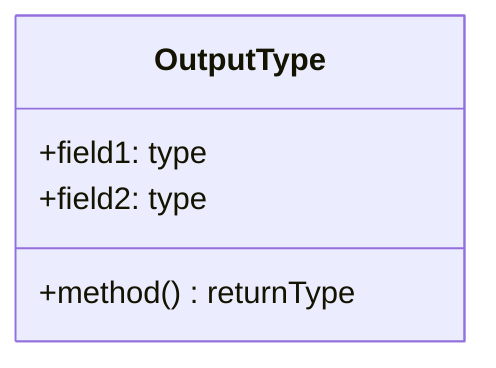

# [Project Name] - Technical Debrief Outline

## Document References

| Topic | Reference Document | Section |
|-------|-------------------|---------|
| Business Requirements | `docs/REQUIREMENTS.md` | Full document |
| API Specifications | `docs/API_SPEC.md` | Data Sources section |
| Current Architecture | `docs/architecture_v1.md` | Pipeline Flow diagram |
| New Architecture | `docs/architecture_v2.md` | System Overview, all stages |
| Sample Output | `reports/output_YYYYMMDD/` | All files |
| Implementation | `src/module/file.py` | Lines XX-YY |

---

## Section 1: Business Problem & Goals

> "[One-sentence elevator pitch that the presenter should say aloud]"

### Key Points

**What we're building:**
- [System/feature description]
- [Key capability 1]
- [Key capability 2]

**Business Goals:**
- [Goal 1]
- [Goal 2]
- [Goal 3]

**Acceptance Criteria:**
- [Criterion 1]
- [Criterion 2]
- [Criterion 3]

---

## Section 2: Domain Context & Prerequisites

### 2A. [Core Concept 1]

**Definition:** [Clear, simple definition]

**Example:**
> **Reference:** `docs/data_examples/example1.json`

```json
{
  "field1": "value",     // Explanation of what this field is used for
  "field2": 123,         // Why this matters for our pipeline
  "nested": {
    "important": true    // Key field we focus on
  }
}
```

**Key fields we use:**
- `field1` - [Why it matters]
- `field2` - [How we use it]
- `nested.important` - [Critical for X]

### 2B. [Core Concept 2]

| Type | Description | Importance |
|------|-------------|------------|
| Type A | [What it does] | **HIGH** - [Why] |
| Type B | [What it does] | **MEDIUM** - [Why] |
| Type C | [What it does] | **LOW** - [Why] |

### 2C. Data Sources

> **Reference:** `docs/API_SPEC.md` - Data Sources section

| Source | Coverage | Rate Limit | Cost | Key Endpoint |
|--------|----------|------------|------|--------------|
| Source 1 | [Scope] | X/hr | Free | `/endpoint` |
| Source 2 | [Scope] | Y/hr | $X/mo | `/endpoint` |

**Why [Primary Source] is PRIMARY:**
- [Reason 1]
- [Reason 2]
- [Reason 3]

### 2D. [Key Technical Concept]

> **This is the key insight for understanding architecture choices.**

**Example:**
> **Reference:** `docs/data_examples/multi_example.json`

```json
{
  "versions": [
    {"type": "Version 3", "date": "2025-01-30"},  // Latest
    {"type": "Version 2", "date": "2025-01-20"},  // Middle
    {"type": "Version 1", "date": "2025-01-10"}   // Original
  ]
}
```

**Why [This Concept] Matters:**
1. [Reason 1 with specific benefit]
2. [Reason 2 with specific benefit]
3. [Reason 3 with specific benefit]

---

## Section 3: [Current System / POC] Walkthrough

### 3A. High-Level Architecture

> **Reference:** `docs/architecture_v1.md` - Pipeline Flow diagram



### 3B. Output Example

> **Reference:** `reports/output_YYYYMMDD/` directory

**Output Structure:**
```
output_YYYYMMDD/
├── output.json     # Structured data
├── output.md       # Human-readable
└── output.docx     # Word document
```

**Key Output Elements:**

1. **[Element 1]:**
   - [Detail with specific example]
   - [Detail with specific example]

2. **[Element 2]:**
   > **Reference:** JSON file lines XXX-YYY

### 3C. Challenges That Led to Redesign

> **Reference:** `docs/DEBRIEF.md` - Limitations & Technical Debt

**Problem-Focused Analysis:**

#### Problem 1: [Name the Problem]

**The Issue:**
- [Specific technical issue]
- [Quantified impact: X items × Y operations = Z total]
- [Cost/time/quality impact]

**Why It's a Problem:**
- [Business impact]
- [Technical limitation]
- [User experience issue]

#### Problem 2: [Name the Problem]

**The Issue:**
- [Specific issue]

**Questions We Can't Answer:**
- [Question 1]?
- [Question 2]?
- [Question 3]?

**Impact:** [Consequence for users/business]

---

## Section 4: [New Design / v2] Architecture

### Architecture Pattern Overview

> **Reference:** `docs/architecture_v2.md` - System Overview Diagram



**Key Difference from [v1]:** [One sentence summary]

### 4A. [Stage/Component 1]: [Name]

> **Reference:** `docs/architecture_v2.md` - Stage 1 section
> **Implementation:** `src/module/stage1.py`

**[v1] Problem:** [What was wrong]

**[v2] Solution:** [How we fixed it]



**Why this design choice:**

1. **[Benefit 1]:**
   - [Explanation with example]
   - [Quantified improvement]

2. **[Benefit 2]:**
   - [Explanation]

### 4B. [Stage/Component 2]: [Name]

> **Reference:** `docs/architecture_v2.md` - Stage 2 section
> **Implementation:** `src/module/stage2.py`

**The Problem [v2] Solves:** [Specific problem from 3C]

| Trigger Condition | Action |
|-------------------|--------|
| Condition A | Action A |
| Condition B | Action B |

**Why [Approach]?**
- [Reason 1 with scenario]
- [Reason 2 with scenario]

### 4C. [Stage/Component 3]: [Name]

> **Reference:** `docs/architecture_v2.md` - Stage 3 section

**The Problem [v2] Solves:** [Specific problem]

**[X] Dimensions (each 0-10):**

| Dimension | What It Measures | Scale Anchors |
|-----------|------------------|---------------|
| Dimension 1 | [Description] | 0-2: Low, 6-8: High, 9-10: Critical |
| Dimension 2 | [Description] | 0-2: Low, 6-8: High, 9-10: Critical |

**What is [Technical Concept]?**

Each output includes:
```json
{
  "dimension": "dimension_name",
  "score": 7,
  "rationale": "Detailed explanation...",
  "evidence": ["quote from source"],
  "reference": "X-Y: anchor text from scale"
}
```

### 4D. Summary: How [v2] Solves [v1] Problems

| [v1] Problem | [v2] Solution | Benefit |
|--------------|---------------|---------|
| Problem 1 | Solution 1 | [Quantified benefit] |
| Problem 2 | Solution 2 | [Quantified benefit] |
| Problem 3 | Solution 3 | [Quantified benefit] |

---

## Section 5: Demo & Q&A

1. **[Demo Item 1]:**
   > File: `path/to/file`
   - [What to show]
   - [What to highlight]

2. **[Demo Item 2]:**
   > File: `path/to/file`
   - [What to show]

---

## Implementation Status

> **Reference:** `docs/architecture_v2.md` - lines XX-YY

| Component | Status |
|-----------|--------|
| Component 1 | **Implemented** |
| Component 2 | **Implemented** |
| Component 3 | **Planned** |
| Component 4 | **Optional, disabled** |

---

## Roadmap

1. **[Phase 1]:** [Description]
2. **[Phase 2]:** [Description]
3. **[Phase 3]:** [Description]

---

## APPENDIX A: [Technical Deep Dive Topic]

### A1. [Subtopic 1] - Technical Details

> **Reference:** `src/module/file.py`

#### INPUTS

```python
List[DataType] where each item contains:
- field1: type      # Description
- field2: type      # Description
```

#### PROCESSING INSTRUCTIONS

> **Reference:** `src/module/file.py` lines XXX-YYY

```
[Template or pseudocode for what the system does]
```

#### OUTPUTS



---

## APPENDIX B: Live Examples

### B1. [Example Type 1]

**File:** `docs/data_examples/example1.json`

```json
{
  // Full real example with inline comments
}
```

### B2. [Example Type 2]

**File:** `docs/data_examples/example2.json`

```json
{
  // Full real example with inline comments
}
```
