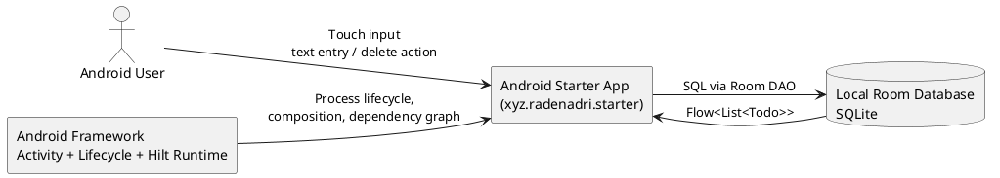
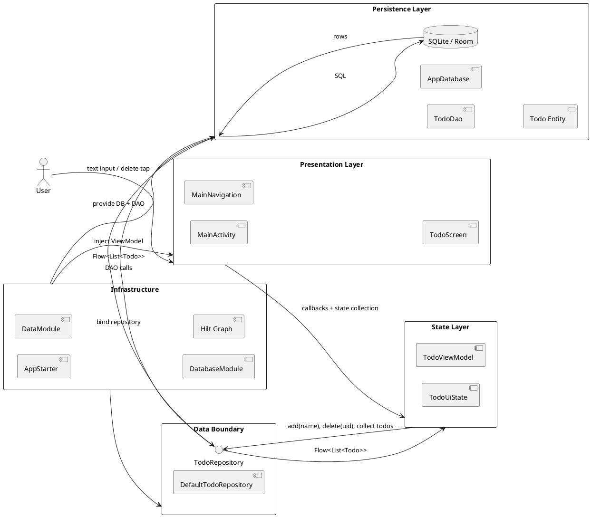

# Architecture Documentation: Android Starter Template

## Table of Contents

1. [Abstract](#abstract)
2. [Context & Scope](#context--scope)
3. [Architecture Constraints & Principles](#architecture-constraints--principles)
4. [High-Level Architecture](#high-level-architecture)
5. [Component Deep Dives](#component-deep-dives)
6. [Cross-Cutting Concerns](#cross-cutting-concerns)
7. [Decision Log (ADRs)](#decision-log-adrs)
8. [Appendix A: Technology Stack Summary](#appendix-a-technology-stack-summary)

## Abstract

This document delineates the architecture of `xyz.radenadri.starter`, a single-module Android starter application engineered to demonstrate a modern local-first mobile architecture using Jetpack Compose, Hilt dependency injection, Room persistence, Kotlin Coroutines, and Flow-based state propagation. The system embodies a layered design in which the user interface is rendered declaratively through Compose, state orchestration is centralized in a Hilt-managed `ViewModel`, domain-facing operations are abstracted behind a repository contract, and local persistence is mediated through Room DAO interfaces. Navigation is implemented with `androidx.navigation3`, although the present application exposes a single root destination. The architecture prioritizes clarity, testability, and template reusability over feature breadth, thereby furnishing a concise reference implementation for future Android applications that require predictable state propagation, dependency injection boundaries, and testable persistence workflows.

## Context & Scope

### Business Goals

The repository serves as an Android architecture starter template rather than a feature-complete product. Its principal goals are:

1. To furnish a reproducible baseline for Android applications using current stable Android Studio tooling.
2. To demonstrate a minimal yet production-aligned architecture comprising Compose UI, ViewModel state management, repository abstraction, Room persistence, Hilt injection, and automated tests.
3. To provide a customizable scaffold that may be renamed and repurposed via `customizer.sh`.
4. To illustrate the end-to-end lifecycle of local data entry, storage, retrieval, and deletion in a small and understandable codebase.

### Stakeholders

- **Android engineers** adopting the template as a foundation for new applications
- **Technical leads** evaluating architectural consistency and maintainability
- **QA engineers** validating data persistence and UI behavior through unit and instrumentation tests
- **New contributors** requiring a compact onboarding target for modern Android patterns

**Figure 1: System Context**

1. The Android user transmits text input and delete actions through the Compose user interface.
2. The application transforms these events into repository operations and reactive state subscriptions.
3. Room persists entities in SQLite and emits updates through `Flow<List<Todo>>`.
4. Android framework services supply lifecycle integration, process bootstrap, and dependency graph construction.

## Architecture Constraints & Principles

### Constraints

| Constraint | Evidence | Architectural Consequence |
|---|---|---|
| Single-module application | `README.md`, project structure | Clear boundaries must be logical rather than Gradle-module based |
| Local persistence only | `TodoDao`, `AppDatabase`, absence of network stack | Repository abstracts persistence, but no remote synchronization exists |
| Declarative UI | `app/build.gradle.kts` Compose dependencies, `TodoScreen.kt` | UI must derive from immutable state snapshots rather than imperative widget mutation |
| Hilt-based DI | `@HiltAndroidApp`, `@AndroidEntryPoint`, Hilt modules | Construction responsibilities are delegated to generated dependency graph |
| Room with KSP schema generation | `ksp { arg("room.schemaLocation", "$projectDir/schemas") }` | Schema evolution is explicit and testable; persistence contracts are compile-time validated |
| Navigation 3 runtime | `Navigation.kt`, `NavigationKeys.kt` | Route keys are typed, although current route graph remains minimal |

### Principles

1. **State flows downward; events flow upward.** `TodoScreen` renders `TodoUiState.Success` data and emits save/delete callbacks upward to `TodoViewModel`.
2. **Persistence details remain below the repository boundary.** `TodoViewModel` depends on `TodoRepository`, not on Room APIs.
3. **Reactive reads, imperative writes.** Reads are modeled as `Flow<List<Todo>>`; mutations are expressed as suspending insert/delete calls.
4. **DI owns object graph construction.** Application bootstrap, repository binding, DAO provisioning, and database singleton ownership are all delegated to Hilt.
5. **Template clarity supersedes optimization.** The code intentionally privileges readability and teaching value over advanced caching, pagination, or modularization.

## High-Level Architecture

The application follows a layered, local-first architecture:

- **Presentation Layer**: `MainActivity`, `MainNavigation`, `TodoScreen`, theme files
- **State Layer**: `TodoViewModel`, `TodoUiState`
- **Domain/Data Boundary**: `TodoRepository`
- **Persistence Layer**: `TodoDao`, `AppDatabase`, `Todo` entity
- **Infrastructure/Composition Layer**: `AppStarter`, `DataModule`, `DatabaseModule`

**Figure 2: Container Diagram**

### Data Flow Walkthrough

#### Hero Scenario A: Create a Todo Item

1. The user enters text in `TodoScreen` (`app/src/main/java/xyz/radenadri/starter/ui/todo/TodoScreen.kt`) and activates the **Save** button.
2. `TodoScreen` invokes `onSave(nameTodo)`, which is wired to `TodoViewModel::addTodo`.
3. `TodoViewModel.addTodo(name: String)` launches a coroutine in `viewModelScope` and delegates to `todoRepository.add(name)`.
4. `DefaultTodoRepository.add(name)` instantiates `Todo(name = name)` and invokes `todoDao.insertTodo(...)`.
5. Room persists the entity into the `Todo` table; `uid` is auto-generated by SQLite.
6. `TodoDao.getTodos()` emits a new `Flow<List<Todo>>` value.
7. `TodoRepository.todos` maps and sorts the emitted list.
8. `TodoViewModel.uiState` converts the stream into `TodoUiState.Success(data)`.
9. `TodoScreen` recomposes and renders the updated list.

**Input → Output Transformations**

| Stage | Input | Output |
|---|---|---|
| UI event | `String` from `TextField`, e.g. `"Compose"` | Callback invocation `onSave("Compose")` |
| ViewModel | `"Compose"` | `todoRepository.add("Compose")` coroutine dispatch |
| Repository | `"Compose"` | `Todo(name = "Compose", uid = 0)` prior to insert |
| Database | Entity without persistent identity | Row with generated `uid`, e.g. `{ uid: 12, name: "Compose" }` |
| Reactive query | Updated table rows | `Flow<List<Todo>>` |
| UI state mapping | `List<Todo>` | `TodoUiState.Success(List<Todo>)` |
| Rendering | `TodoUiState.Success` | Compose rows with labels and delete buttons |

#### Hero Scenario B: Delete a Todo Item

1. `TodoScreen` renders each row from `List<Todo>` and binds delete to `onDelete(it.uid)`.
2. `TodoViewModel.deleteTodo(uid: Int)` launches a coroutine and calls `todoRepository.delete(uid)`.
3. `DefaultTodoRepository.delete(uid)` forwards the identifier to `todoDao.deleteTodo(uid)`.
4. Room executes `DELETE FROM todo WHERE uid = :uid`.
5. The DAO query stream emits the updated result set.
6. The UI recomposes with the deleted row removed.

**Input → Output Transformations**

| Stage | Input | Output |
|---|---|---|
| UI event | `uid: Int`, e.g. `12` | Callback invocation `onDelete(12)` |
| ViewModel | `12` | Repository delete request |
| Repository | `12` | DAO SQL delete command |
| DAO | `uid = 12` | Row deletion in SQLite |
| Reactive query | Reduced row set | Updated `Flow<List<Todo>>` |
| UI state | Updated list | Recomposition without deleted item |

## Component Deep Dives

### Component Responsibility Matrix

| Component | Primary Responsibility | Key Dependencies | Input/Output | Failure Modes | Recovery Strategies |
|-----------|------------------------|------------------|--------------|---------------|--------------------|
| `AppStarter` | Initializes Hilt application graph at process startup | Hilt runtime | Android process start → dependency graph availability | Hilt misconfiguration, generated code mismatch | Compile-time annotation validation; process fails fast |
| `MainActivity` | Hosts Compose content and root navigation container | Android Activity, Compose runtime, Hilt | Activity lifecycle events → rendered root composition | Activity recreation, theme setup defects | Compose recomposition and Android lifecycle restore behavior |
| `MainNavigation` | Establishes typed navigation back stack and root route | Navigation 3 runtime | `Main` NavKey → `TodoScreen` rendering | Back stack misuse, missing entry mappings | Strongly typed `NavKey`; minimal route graph reduces risk |
| `TodoScreen` | Renders text entry and list UI; forwards user actions upward | Compose Material3, lifecycle state collection | `TodoUiState` + callbacks → displayed list and actions | Empty/error state not rendered, invalid input, recomposition anomalies | Reactive rendering; current implementation lacks explicit error/empty UX |
| `TodoViewModel` | Orchestrates UI state from repository stream and mutation events | ViewModel, Coroutines, Flow, `TodoRepository` | UI events → repository calls; `Flow<List<Todo>>` → `StateFlow<TodoUiState>` | Repository exceptions, coroutine cancellation | `catch { emit(Error(it)) }`; lifecycle-bound `viewModelScope` |
| `TodoRepository` / `DefaultTodoRepository` | Abstracts persistence operations from presentation layer | `TodoDao`, Kotlin Flow | `String`/`uid` mutations and DAO stream → app-facing entity stream | DAO exceptions, schema mismatch, invalid identifiers | Room compile-time query validation; suspend boundary propagates failures |
| `TodoDao` | Defines SQL read/write/delete contract | Room | SQL query + entities ↔ rows / `Flow<List<Todo>>` | Query errors, constraint mismatch, invalid schema migration | Room annotation processing; app restart after developer correction |
| `AppDatabase` | Defines Room database and DAO access surface | RoomDatabase | Context/configuration → DAO factory | Schema version mismatch, corrupted DB | Explicit schema versioning; destructive or manual migration could be added later |
| `DataModule` | Binds repository interface to concrete implementation | Hilt `@Binds` | `DefaultTodoRepository` → `TodoRepository` binding | Missing binding, DI ambiguity | Compile-time Hilt graph validation |
| `DatabaseModule` | Provides singleton DB and DAO instances | Hilt `@Provides`, Room | `Context` → `AppDatabase`, `TodoDao` | Incorrect DB name, context leaks, multiple DB instances | `@Singleton` database provider; application context scope |
| `FakeTodoRepository` | Supplies deterministic fake data for tests | Flow, `Todo` | Static list → `Flow<List<Todo>>` | Mutation methods unimplemented | Safe for read-only test scenarios; explicit failure on misuse |

### 4.1 `AppStarter`

**Purpose:** Supplies application-level Hilt bootstrap so that dependency injection may be established before any Android component requests injected dependencies.

**Implementation Details (The "How"):**
- **Stack:** Android `Application`, Hilt
- **Location:** `app/src/main/java/xyz/radenadri/starter/AppStarter.kt`
- **Mechanism:** The class is annotated with `@HiltAndroidApp`, prompting Hilt to generate the base application component and singleton graph.

**Engineering Analysis (The "Why"):**
- Hilt is employed rather than manual service locators because it furnishes compile-time graph validation and removes repetitive construction code. For a starter template, this is preferable to hand-written factories, which would obscure the architectural teaching goal with boilerplate.
- The class contains no custom logic. This is a deliberate decision: startup remains deterministic and testable, and the application object does not become an unstructured global state container.
- Failure mode is intentionally fail-fast. If Hilt generation or component wiring is invalid, the application will not initialize correctly, thereby surfacing configuration errors early in development.

### 4.2 `MainActivity`

**Purpose:** Hosts the top-level Compose tree and configures edge-to-edge rendering.

**Implementation Details (The "How"):**
- **Stack:** `ComponentActivity`, Compose, Material 3, Hilt Android entry point
- **Location:** `app/src/main/java/xyz/radenadri/starter/ui/MainActivity.kt`
- **Mechanism:** `onCreate` invokes `enableEdgeToEdge`, then `setContent { MyApplicationTheme { Surface { MainNavigation() }}}`.

**Engineering Analysis (The "Why"):**
- Compose is selected over XML-based layouts because the template aims to demonstrate the current canonical Android UI approach with explicit state-driven recomposition.
- `Surface` with `MaterialTheme.colorScheme.background` centralizes base visual styling and reduces repeated UI chrome configuration across screens.
- `@AndroidEntryPoint` is required even though the activity does not inject fields directly, because its descendants retrieve Hilt-managed ViewModels. This aligns lifecycle scopes with the DI graph.
- No saved-instance-state logic is added because the primary persisted state already resides in Room, and the template intentionally avoids nonessential complexity.

### 4.3 `MainNavigation`

**Purpose:** Provides a typed navigation container and maps the `Main` route to the todo feature.

**Implementation Details (The "How"):**
- **Stack:** `androidx.navigation3.runtime`, `androidx.navigation3.ui`
- **Location:** `app/src/main/java/xyz/radenadri/starter/ui/Navigation.kt`
- **Mechanism:** `rememberNavBackStack(Main)` instantiates a back stack seeded with the `Main` key; `NavDisplay` resolves entries through `entryProvider`.

**Engineering Analysis (The "Why"):**
- Navigation 3 is employed despite the current single-screen topology because the template intends to be extended. A navigation system present from inception removes the need for later architectural rewrites when additional routes are introduced.
- Typed `NavKey` objects (`NavigationKeys.kt`) are preferable to raw string routes in this template because they reduce accidental route spelling drift and improve IDE-assisted refactoring.
- The current graph is intentionally minimal. This lowers conceptual load for new adopters while still demonstrating extensibility.

### 4.4 `TodoScreen`

**Purpose:** Renders the todo list and mutation controls while remaining free of persistence logic.

**Implementation Details (The "How"):**
- **Stack:** Compose, Material 3, lifecycle compose state collection
- **Location:** `app/src/main/java/xyz/radenadri/starter/ui/todo/TodoScreen.kt`
- **Mechanism:** The outer composable collects `viewModel.uiState` via `collectAsStateWithLifecycle`. The inner composable renders a `TextField`, a `Save` button, and one delete button per `Todo`.

**Engineering Analysis (The "Why"):**
- The composable is split into a route-level function and a stateless rendering function. This separation permits preview generation and reduces the coupling between DI/lifecycle concerns and visual composition.
- The delete action transmits `uid` rather than `name`. This is a meaningful architectural correction: persistence identity should rely on stable primary keys, not mutable display fields.
- The current implementation renders only the `Success` state and silently omits `Loading` and `Error`. This is acceptable for a starter template but constitutes a known UX limitation. In production, explicit loading/error surfaces would be required.
- Input validation is absent. Empty strings can be submitted. This omission simplifies the example but would need remediation in a production-facing system.

### 4.5 `TodoViewModel`

**Purpose:** Converts repository flows into UI state and serializes mutation operations within a lifecycle-aware coroutine scope.

**Implementation Details (The "How"):**
- **Stack:** AndroidX ViewModel, Coroutines, Flow, Hilt
- **Location:** `app/src/main/java/xyz/radenadri/starter/ui/todo/TodoViewModel.kt`
- **Mechanism:** 
  - Reads: `todoRepository.todos.map<List<Todo>, TodoUiState>(::Success).catch { emit(Error(it)) }.stateIn(...)`
  - Writes: `addTodo` and `deleteTodo` launch coroutines in `viewModelScope`

**Engineering Analysis (The "Why"):**
- `StateFlow` is used rather than exposing raw `Flow` directly to the UI because Compose screens generally benefit from a replayable current-state holder rather than a cold stream that may restart per collector.
- `SharingStarted.WhileSubscribed(5000)` balances resource conservation and UI continuity. A five-second stop timeout avoids immediately tearing down upstream collection during transient lifecycle interruptions such as configuration changes or navigation transitions.
- The `catch` operator lifts repository exceptions into `TodoUiState.Error`, preserving unidirectional data flow. However, write-path exceptions inside `launch` are not separately surfaced to the UI. This is sufficient for a teaching template but not for robust user-facing feedback.
- The ViewModel remains intentionally thin. Business logic is minimal because the template’s primary lesson is separation of concerns rather than domain rule complexity.

### 4.6 `TodoRepository` and `DefaultTodoRepository`

**Purpose:** Define and implement the boundary between UI/state orchestration and persistence mechanics.

**Implementation Details (The "How"):**
- **Stack:** Kotlin interface abstraction, Flow transformation, Room DAO dependency
- **Location:** `app/src/main/java/xyz/radenadri/starter/data/TodoRepository.kt`
- **Mechanism:**
  - `val todos: Flow<List<Todo>>`
  - `suspend fun add(name: String)`
  - `suspend fun delete(uid: Int)`
  - Implementation maps `todoDao.getTodos()` through `sortedByDescending(Todo::uid)`

**Engineering Analysis (The "Why"):**
- The repository interface is maintained even though only one data source exists. This appears redundant in a small application, yet it materially improves test substitution and future extensibility (e.g., local+remote coordination).
- Returning `List<Todo>` instead of `List<String>` preserves identity and simplifies mutation correctness. The earlier string-only approach would obscure primary keys and complicate deletion semantics.
- Sorting is performed both in SQL (`ORDER BY uid DESC LIMIT 10`) and again in Kotlin (`sortedByDescending`). The second sort is functionally redundant given the DAO query and adds minimal overhead for small lists. It does, however, provide a defensive guarantee if the SQL query changes later. In a production system, duplicated ordering logic would normally be removed to preserve a single source of truth.
- The repository performs no validation or deduplication. This keeps the abstraction thin, but it means invalid or duplicate names are permissible.

### 4.7 `TodoDao` and `AppDatabase`

**Purpose:** Encapsulate SQL persistence and expose reactive access to the local todo table.

**Implementation Details (The "How"):**
- **Stack:** Room, SQLite, `Flow`
- **Locations:** 
  - `app/src/main/java/xyz/radenadri/starter/data/local/database/Todo.kt`
  - `app/src/main/java/xyz/radenadri/starter/data/local/database/AppDatabase.kt`
- **Mechanism:**
  - Entity: `Todo(name: String)` with `@PrimaryKey(autoGenerate = true) var uid: Int = 0`
  - Query: `SELECT * FROM todo ORDER BY uid DESC LIMIT 10`
  - Insert: `@Insert`
  - Delete: `DELETE FROM todo WHERE uid = :uid`
  - Database version: `1`

**Engineering Analysis (The "Why"):**
- Room is selected instead of raw SQLite APIs because it yields compile-time query validation, type-safe DAO contracts, and native coroutine/Flow interoperation with significantly less boilerplate.
- The entity uses an auto-generated integer primary key. This is appropriate for a local-only template because it is simple, compact, and human-irrelevant. A distributed system would likely prefer UUIDs to avoid key collisions across devices.
- The query limits results to the latest ten rows. This is a noteworthy architectural choice: it constrains memory/rendering cost and keeps the UI concise, but it also means older records become invisible without pagination or archive access.
- No migration strategy is defined beyond schema version `1`. For a starter template this is acceptable; for a long-lived application explicit migration objects would become mandatory.

### 4.8 `DataModule` and `DatabaseModule`

**Purpose:** Declare DI bindings for repository and persistence components.

**Implementation Details (The "How"):**
- **Stack:** Hilt `@Binds`, `@Provides`, singleton component
- **Locations:**
  - `app/src/main/java/xyz/radenadri/starter/data/di/DataModule.kt`
  - `app/src/main/java/xyz/radenadri/starter/data/local/di/DatabaseModule.kt`
- **Mechanism:**
  - `DataModule` binds `DefaultTodoRepository` to `TodoRepository`
  - `DatabaseModule` provides `AppDatabase` singleton and extracts `TodoDao`

**Engineering Analysis (The "Why"):**
- `@Binds` is used for the repository because it is more declarative and generates less code than a manual provider when only interface-to-implementation mapping is needed.
- `@Provides @Singleton` is used for the database because Room database construction requires a runtime `Context`.
- The database name is `"Todo"`. This is adequate for the template, though in production a lowercased, more namespace-specific filename such as `todo.db` would typically be preferred for clarity and filesystem consistency.
- `provideTodoDao` is not annotated `@Singleton`, but because it is derived from a singleton database instance, the practical lifecycle remains stable.

### 4.9 `FakeTodoRepository`

**Purpose:** Supplies predictable fake data for tests and instrumentation scenarios.

**Implementation Details (The "How"):**
- **Stack:** Flow `flowOf`, in-memory static fixtures
- **Location:** `app/src/main/java/xyz/radenadri/starter/data/di/DataModule.kt`
- **Mechanism:** Emits `fakeTodos.map { Todo(name = it.name) }` as a read-only `Flow<List<Todo>>`; mutation methods throw `NotImplementedError`.

**Engineering Analysis (The "Why"):**
- Co-locating a fake in the same source set is expedient for a template, though larger systems would segregate test doubles into dedicated test packages to avoid accidental production references.
- The fake intentionally fails on writes. This makes unsupported test paths explicit and prevents silent false positives.
- The generated fake `Todo` objects do not preserve meaningful `uid` values, which is acceptable for read-only rendering tests but insufficient for delete-path verification.

## Cross-Cutting Concerns

### Observability

The codebase does not currently implement structured logging, metrics, or distributed tracing. This omission is defensible in a starter template because no network boundaries or background services exist. However, the absence of observability has concrete consequences:

- write-path failures inside `viewModelScope.launch` may be difficult to diagnose in production;
- Room query or migration errors would primarily surface through crashes or unhandled exceptions;
- user behavior and UI latency cannot be measured.

A production extension should introduce at least:
1. structured log events around add/delete operations,
2. crash reporting,
3. optionally performance tracing around database access and first composition.

### Failure Modes & Recovery

| Failure Mode | Where It Occurs | Current Behavior | Recovery |
|---|---|---|---|
| Repository stream throws | `TodoViewModel.uiState` flow pipeline | Converted to `TodoUiState.Error` | UI currently does not render error state, so failure is hidden unless explicitly surfaced later |
| Write coroutine throws | `addTodo`, `deleteTodo` | Exception propagates in coroutine context | No user-facing recovery; requires improved exception handling |
| Schema/version mismatch | Room database open | App may fail to initialize DB | Developer must provide migration or clear data |
| Invalid deletion identifier | DAO `DELETE WHERE uid = :uid` | No row deleted | Safe no-op at SQL level |
| Empty todo submission | UI → repository | Empty string may be inserted | No current validation |
| Process recreation | Android lifecycle | Room persists data; Compose recomposes | Hilt and Room reconstruct state from persisted database |

### Deployment & Infrastructure

The system is a local Android application with no server-side infrastructure. Deployment consists of packaging the APK/AAB through Gradle and distributing it via standard Android channels. Consequently:

- There is no external API availability dependency.
- Persistence is device-local SQLite via Room.
- Security posture is largely bounded by platform sandboxing rather than network transport concerns.
- Scalability concerns are confined to on-device list rendering and local storage size.

## Decision Log (ADRs)

### ADR-001: Employ Jetpack Compose for UI

**Context:** The template requires a modern, concise UI system suitable for new Android projects.

**Decision:** Use Jetpack Compose and Material 3 instead of XML layouts and imperative view binding.

**Consequences:** UI code becomes state-driven and previewable, which improves readability and accelerates iteration. The cost is deeper reliance on Compose runtime semantics and recomposition literacy.

### ADR-002: Use Hilt for Dependency Injection

**Context:** The template must demonstrate testable object construction and clear dependency boundaries without manual factory proliferation.

**Decision:** Use Hilt annotations for application, activity, and module wiring.

**Consequences:** Boilerplate is reduced and compile-time validation is gained. Build complexity increases through annotation processing and generated code.

### ADR-003: Use Room as the Persistence Mechanism

**Context:** The application needs local structured storage with reactive updates.

**Decision:** Persist todos in Room over SQLite, exposed through DAO interfaces and `Flow`.

**Consequences:** Query validation and coroutine interoperability improve substantially. Schema migration management becomes a long-term maintenance responsibility.

### ADR-004: Preserve a Repository Layer Despite Single Data Source

**Context:** The codebase presently has only one DAO-backed local data source.

**Decision:** Retain a repository interface and implementation boundary.

**Consequences:** The architecture remains testable and extensible at modest additional abstraction cost. For extremely small projects this may appear excessive, but as a starter template it establishes the correct evolution path.

### ADR-005: Use Typed Navigation Keys with Navigation 3

**Context:** The template should be extendable to multiple destinations while remaining type-safe.

**Decision:** Seed the project with `androidx.navigation3` and a typed `Main : NavKey` route.

**Consequences:** Future navigation can scale without converting from ad hoc string routes. Present complexity slightly exceeds immediate needs, but the extension path is cleaner.

## Appendix A: Technology Stack Summary

| Category | Technology | Version / Source | Purpose | Architectural Layer |
|----------|-----------|------------------|---------|---------------------|
| Android Platform | Android SDK | `compileSdk = 36`, `targetSdk = 36`, `minSdk = 23` | Runtime platform and app packaging | Foundation |
| UI | Jetpack Compose | via Compose BOM | Declarative UI rendering | Presentation |
| Design System | Material 3 | `androidx.compose.material3` | Theming and UI components | Presentation |
| Activity Integration | `androidx.activity.compose` | Gradle dependency | Compose host activity integration | Presentation |
| Lifecycle | `androidx.lifecycle.runtime.ktx`, `lifecycle-runtime-compose`, `lifecycle-viewmodel-compose` | Gradle dependencies | Lifecycle-aware state collection and ViewModel integration | Presentation / State |
| ViewModel | AndroidX ViewModel | Gradle dependencies | State orchestration | State |
| Navigation | `androidx.navigation3.runtime`, `androidx.navigation3.ui`, `androidx.lifecycle.viewmodel.navigation3` | Gradle dependencies | Typed navigation back stack and screen resolution | Presentation |
| Dependency Injection | Hilt | `libs.hilt.android`, compiler via KSP | Object graph construction and injection | Infrastructure |
| Persistence | Room | `androidx.room.runtime`, `androidx.room.ktx`, compiler via KSP | SQLite abstraction, DAO generation, reactive queries | Persistence |
| Async | Kotlin Coroutines / Flow | standard Kotlin libraries in use | Async mutations and reactive streams | State / Data |
| Serialization | Kotlin Serialization plugin | Gradle plugin | Supports typed nav keys serialization | Infrastructure |
| Code Generation | KSP | Gradle plugin | Hilt and Room code generation | Build Infrastructure |
| Unit Testing | JUnit, Coroutines Test | Gradle dependencies | Repository and ViewModel verification | Quality |
| UI / Instrumentation Testing | Compose UI Test, AndroidX Test, Hilt Testing | Gradle dependencies | End-to-end and UI verification | Quality |

## Quality Validation

- Required sections present: yes
- Component Responsibility Matrix present: yes
- Major components documented with purpose, implementation, and engineering analysis: yes
- Data flow transformations included: yes
- Diagram syntax included in fenced `plantuml` blocks: yes
- Decision rationale and trade-offs documented: yes
- Failure modes and recovery paths documented: yes